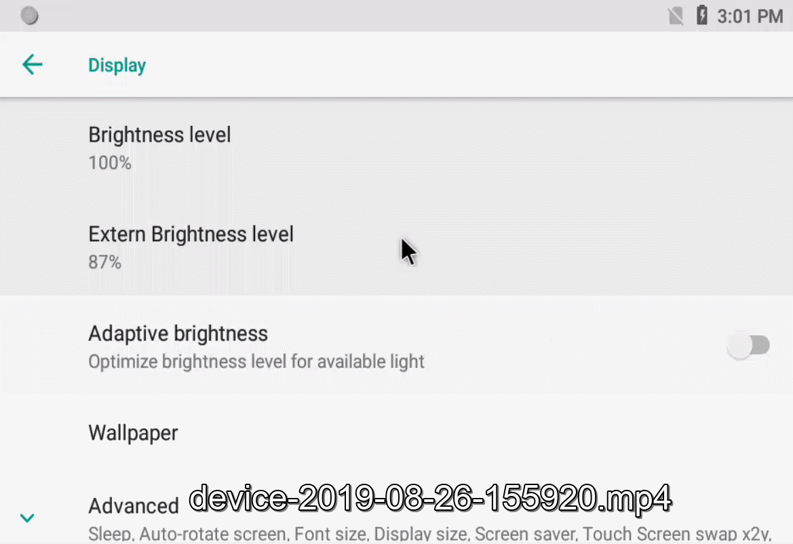

# Android-DualBacklightAdjust
Android dual-screen display device, apply patches to enable Android to support main and secondary screen backlight separate adjustment.

## Preview


## Integration
1. Implement the secondary screen backlight adjustment driver, such as the Rockchip platform has been implemented by default, just add the secondary screen backlight dts node.  
```diff
diff --git a/kernel/arch/arm/boot/dts/rk3288-android.dtsi b/kernel/arch/arm/boot/dts/rk3288-android.dtsi
index b7ff8df..52a7efd 100755
--- a/kernel/arch/arm/boot/dts/rk3288-android.dtsi
+++ b/kernel/arch/arm/boot/dts/rk3288-android.dtsi
@@ -221,6 +221,38 @@
                pwms = <&pwm0 0 1000000 0>;
        };

+       backlight_extend: backlight_extend {
+               compatible = "pwm-backlight";
+               brightness-levels = <
+                       255 231 231 230 230 229 229 229 228 228
+                       228 227 227 227 226 226 226 226 225 225
+                       225 224 224 224 224 223 223 223 222 222
+                       222 221 221 221 220 220 219 218 217 216
+                       215 214 213 212 211 210 209 208 207 206
+                       205 204 203 202 201 200 199 198 197 196
+                       195 194 193 192 191 190 189 188 187 186
+                       185 184 183 182 181 180 179 178 177 176
+                       175 174 173 172 171 170 169 168 167 166
+                       165 164 163 162 161 169 159 158 157 156
+                       155 154 153 152 151 150 149 148 147 146
+                       145 143 142 141 140 139 138 137 136 135
+                       134 133 132 131 130 129 128 127 126 125
+                       124 123 122 121 120 119 118 117 116 115
+                       114 113 112 111 110 109 108 107 106 105
+                       104 103 102 101 100 99 98 97 96
+                       95 94 93 92 91 90 89 88 87 86
+                       85 84 83 82 81 80 79 78 77 76
+                       75 74 73 72 71 70 69 68 67 66
+                       65 64 63 62 61 60 59 58 57 56
+                       55 54 53 52 51 50 49 48 47 46
+                       45 44 43 42 41 40 39 38 37 36
+                       35 34 33 32 31 30 29 28 27 26
+                       25 24 23 22 21 20 19 18 17 16
+                       15 14 13 12 11 10 9 8 7 6
+                       5 4 3 2 1 0>;
+               default-brightness-level = <128>;
+               pwms = <&pwm2 0 1000000 0>;
+       };
        display-subsystem {
                status = "okay";

```
2. Main and secondary screen device nodes are as follows.
```
/sys/class/backlight/backlight/brightness
/sys/class/backlight/backlight_extend/brightness
```
3. Apply backlight.patch.
4. Update api.
```
$ make update-api
```
5. Recompile Android.


## Usage
### Settings
Settings->Display->Extern Brightness level.

### API
1. Add ILightsService.aidl to app/src/main/aidl/android/os/ILightsService.aidl.
```
package android.os;
 
/** {@hide} */
interface ILightsService
{
	boolean setBrightness(int type, int brightness);
}

```
2. Call the setBrightness method.
```
package com.ayst.sample.items.backlight;

import android.annotation.SuppressLint;
import android.content.Context;
import android.os.IBinder;
import android.os.ILightsService;
import android.os.RemoteException;
import android.util.Log;

import java.lang.reflect.Method;

/**
 * Created by Administrator on 2018/11/6.
 */

public class Lights {
    private ILightsService mLightsService;

    @SuppressLint("WrongConstant")
    public Lights(Context context) {
        Method method = null;
        try {
            method = Class.forName("android.os.ServiceManager").getMethod("getService", String.class);
            IBinder binder = (IBinder) method.invoke(null, new Object[]{"lights"});
            mLightsService = ILightsService.Stub.asInterface(binder);
            if (mLightsService == null) {
                Log.i("Lights", "mLightsService is null");
            }
        } catch (Exception e) {
            e.printStackTrace();
        }
    }

    /**
     * @param type
     *     BACKLIGHT=0,
     *     BACKLIGHT_EXT=1,
     *     KEYBOARD=2,
     *     BUTTONS=3,
     *     BATTERY=4,
     *     NOTIFICATIONS=5,
     *     ATTENTION=6,
     *     BLUETOOTH=7,
     *     WIFI=8,
     * @param brightness 0~255
     * @return
     */
    public boolean setBrightness(int type, int brightness) {
        if (null != mLightsService) {
            try {
                return mLightsService.setBrightness(type, brightness);
            } catch (RemoteException e) {
                e.printStackTrace();
            }
        }
        return false;
    }
}

```

## Developed By
* ayst.shen@foxmail.com

## License
```
Copyright 2019 Bob Shen

Licensed under the Apache License, Version 2.0 (the "License"); you may 
not use this file except in compliance with the License. You may obtain 
a copy of the License at

http://www.apache.org/licenses/LICENSE-2.0

Unless required by applicable law or agreed to in writing, software 
distributed under the License is distributed on an "AS IS" BASIS, WITHOUT 
WARRANTIES OR CONDITIONS OF ANY KIND, either express or implied. See the 
License for the specific language governing permissions and limitations 
under the License.
```
